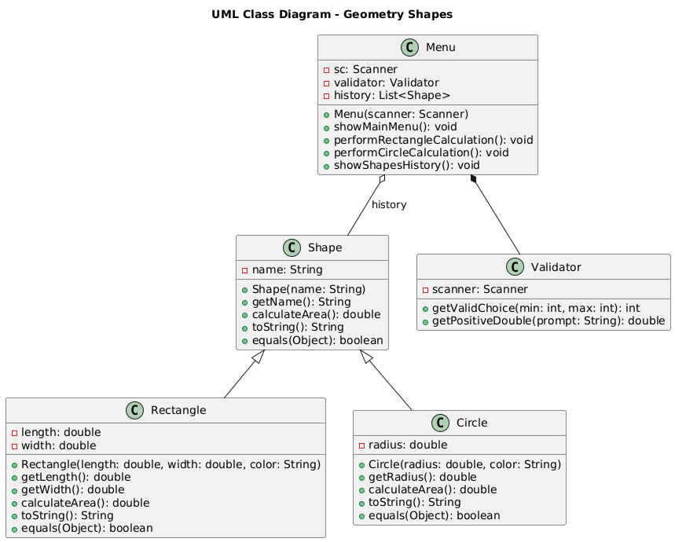

# Описание предметной области

## Название системы: Геометрические фигуры

**Цель системы**  
Программа позволяет рассчитывать площади геометрических фигур и сохранять историю расчетов. Пользователь может выбирать фигуры, вводить их параметры и получать результаты расчетов, а также просматривать историю выполненных расчетов.

### Структура и элементы системы

Система состоит из следующих классов:

1. **Shape (Абстрактный класс)**  
   Представляет геометрическую фигуру. Определяет базовый метод `calculateArea()`, который рассчитывает площадь фигуры, и метод `toString()`, описывающий фигуру.
   - **Поля**: `name` (название фигуры).
   - **Методы**: `calculateArea()`, `toString()`, `equals()`.

2. **Rectangle (Класс)**  
   Представляет прямоугольник и является наследником класса `Shape`. Определяет поля для хранения длины и ширины прямоугольника и реализует метод для расчета площади.
   - **Поля**: `length`, `width`.
   - **Методы**: `calculateArea()`, `toString()`, `equals()`.

3. **Circle (Класс)**  
   Представляет круг и является наследником класса `Shape`. Определяет поле для хранения радиуса круга и реализует метод для расчета площади.
   - **Поля**: `radius`.
   - **Методы**: `calculateArea()`, `toString()`, `equals()`.

4. **Menu (Класс)**  
   Представляет меню для взаимодействия с пользователем. Включает методы для выполнения расчетов и работы с историей.
   - **Поля**: `history` (список для хранения расчетов фигур), `validator` (для проверки ввода), `sc` (сканер).
   - **Методы**: `showMainMenu()`, `performRectangleCalculation()`, `performCircleCalculation()`, `showShapesHistory()`.

5. **Validator (Класс)**  
   Обеспечивает проверку пользовательского ввода и помогает избежать ошибок.
   - **Поля**: `scanner`.
   - **Методы**: `getValidChoice()`, `getPositiveDouble()`.

### Связи

- **Иерархия наследования**: `Rectangle` и `Circle` наследуются от абстрактного класса `Shape`.
- **Ассоциативная связь**: `Menu` связан с `Shape` через ассоциацию `history` (список объектов типа `Shape`), который хранит информацию о предыдущих расчетах фигур.
